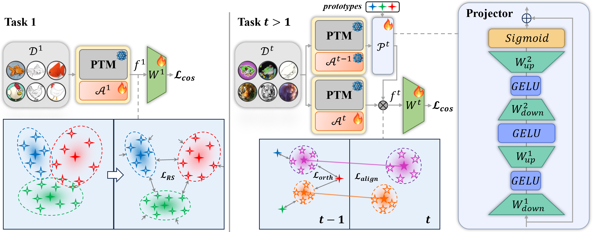

# Representation-Steered Incremental Adapter-Tuning for Class-Incremental Learning with Pre-Trained Models

  

This repository serves as the official implementation corresponding to the paper titled "Representation-Steered Incremental Adapter-Tuning for Class-Incremental Learning with Pre-Trained Models". 


## Installation
### Requirements
Ubuntu 20.04 LTS

Python 3.10

CUDA 11.8

Detailed package information and corresponding versions are available in the requirements.txt file.

### Data preparation

The overall directory structure should be:
```
RSIAT/
├──data/
├──datasets/
│   ├──cifar-100-python/
│   ├──cub/
│   ├──imagenet-a/
│   ├──imagenet-r/
│   ├──omnibenchmark/
│   ├──vtab/
│   ......
├──.......
```

## Training and evaluation

The training and evaluation instructions for each dataset are in the "./args.sh" file. Each dataset can be calculated separately, and the results are stored in the "./logs" folder.